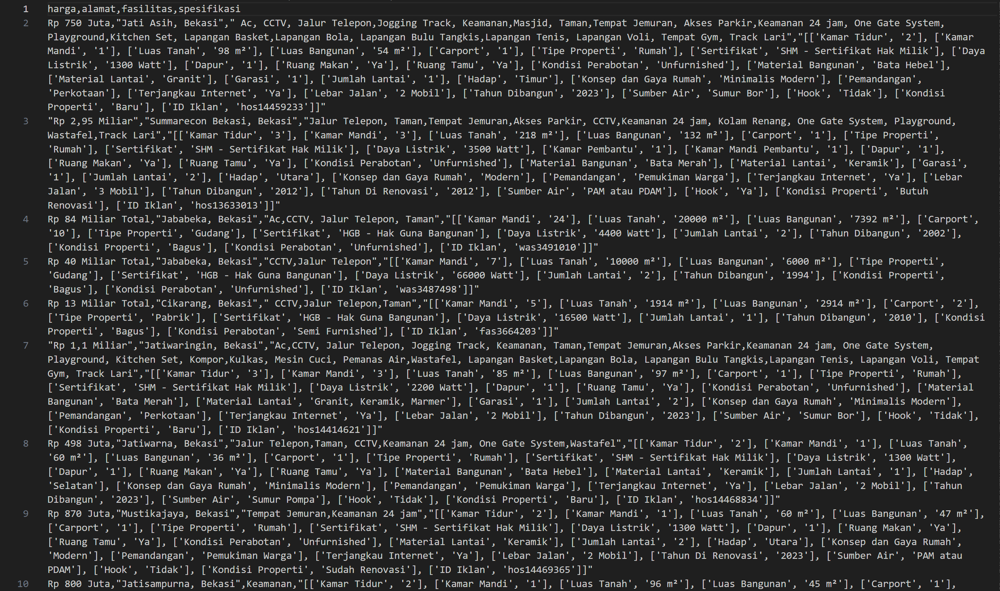

## INSTALLATION (FOR WINDOWS)
1. Install WSL2 

* [Download & install WSL2](https://github.com)

2. Install virtual environment

* Run ```mkdir web_scrap``` and create virtual environment by ```python3 -m venv .venv```

* Activate virtual environment ```. .venv/bin/activate```

3. Install and setup Scrapy

* Run ```pip install scrapy```

* For complete installation guide visit [Scrapy Installation](https://docs.scrapy.org/en/latest/intro/install.html)

## RUN SCRAPY
You can clone this repository and scrap directly by running script2.sh.

## RESULT
This is the sample preview of scrapped data.

